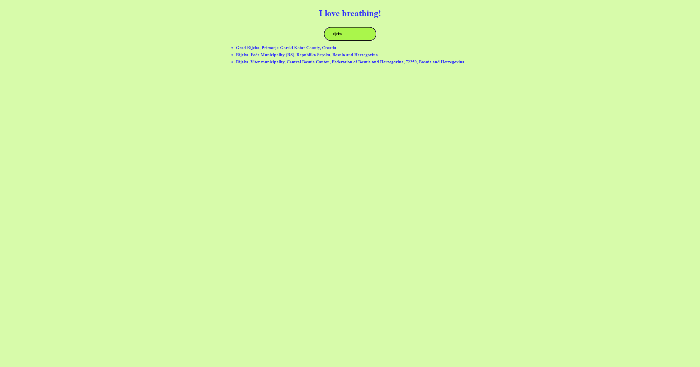
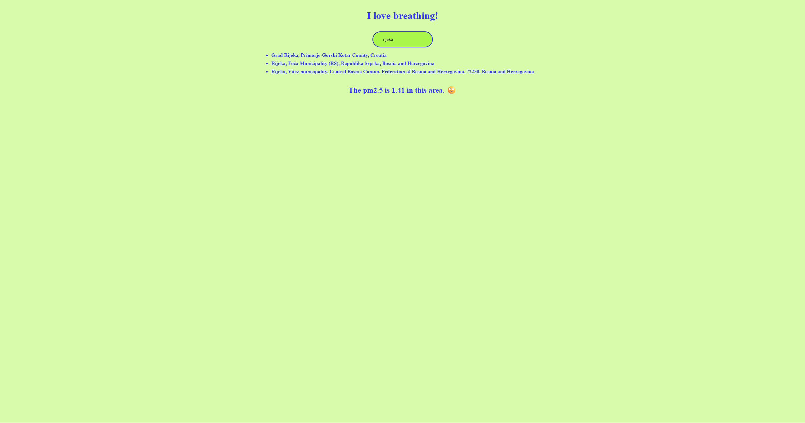
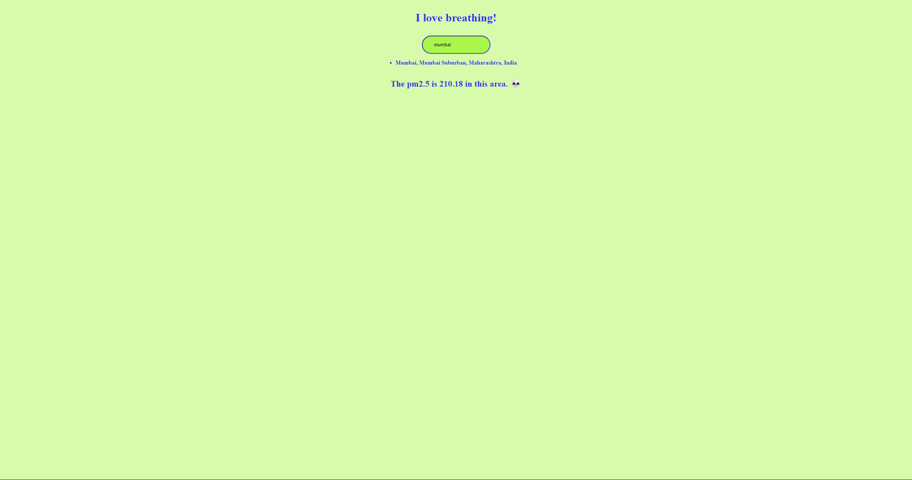

# Fresh Air — PM2.5 Air Quality Checker

A small, fast React app that helps you check PM2.5 air pollution levels for any location using OpenStreetMap (Nominatim) for geocoding and OpenWeatherMap's Air Pollution API for PM2.5 data.

## Table of Contents
- [Tech stack](#tech-stack)
- [Features](#features)
- [Environment variables](#environment-variables)
- [Installation](#installation)
- [Screenshots](#screenshots)
- [Scripts](#scripts)
- [License](#license)

## Tech stack
- React 19 + Vite
- Axios for HTTP requests

## Features
- Search locations with OpenStreetMap (Nominatim) geocoding (no API key required).
- Fetch PM2.5 air pollution values from OpenWeatherMap Air Pollution API.
- Simple, responsive UI built with React and Vite.

## Environment variables
- Create a `.env` file in the project root with your OpenWeatherMap API key. Vite exposes variables starting with `VITE_` to client code.

### Example `.env`

```bash
VITE_WEATHER_API_KEY=your_openweathermap_api_key_here
```

## Installation

### Prerequisites
- Node.js (18+ recommended)
- An OpenWeatherMap API key (Air Pollution endpoints require an API key)

### Installation

1. Clone the repository

```bash
git clone https://github.com/Sebastijan-Dominis/fresh-air
cd fresh-air
```

2. Install the dependencies

```bash
npm install
```

3. Run the server

```bash
npm run dev
```

4. Open http://localhost:5173 in your browser (Vite default)

## Screenshots








## Scripts
- `npm run dev` — Start Vite dev server
- `npm run build` — Build production bundle
- `npm run preview` — Preview the production build locally
- `npm run lint` — Run ESLint

## License
See the `LICENSE` file in this repository for license details.

**Contributions**
- Feel free to contribute if you wish. Open an issue or submit a pull request with a clear description of the change.

**Contact**
- Author: repository owner (see repository metadata).
